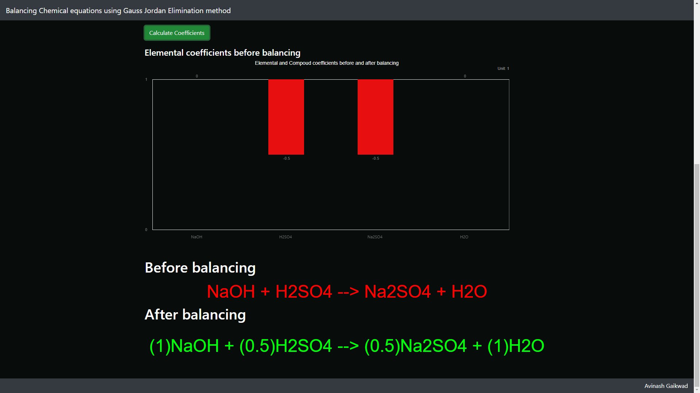

# Balancing Chemical Equations
This web application will generate a balanced equation after a valid chemical reaction is given as an input. It uses the Gauss-Jordan elimination method for finding out the compound coefficients in order to balance out the whole equation.
 

## Table of Contents
1. [Screenshots](#screenshots)

## Screenshots
### Look and feel of the website

### Balanced equations output

